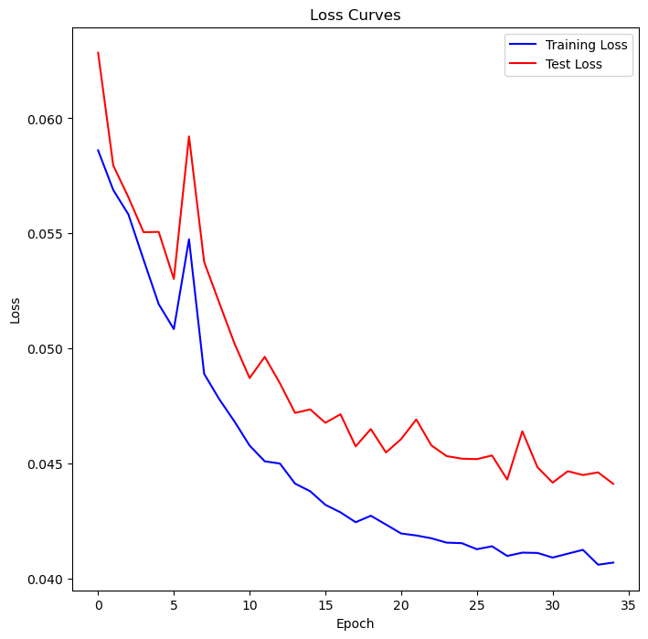
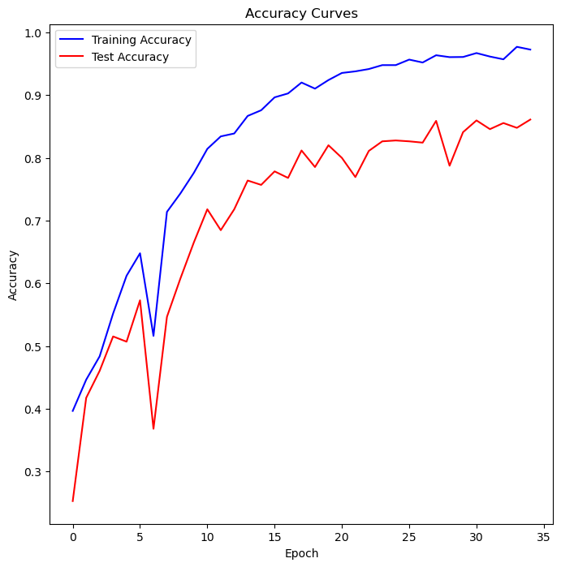

## CNN Model Overview

This document provides an overview of a Convolutional Neural Network (CNN) model that has been trained on Augmented data and evaluated with the following parameters and results.

### Training Parameters

- **Learning Rate**: 0.01

  - The learning rate determines the step size at each iteration while moving toward a minimum of the loss function. A learning rate of 0.01 is relatively high, which means the model updates its weights more significantly with each iteration.

- **Optimizer**: Adam

  - Adam (Adaptive Moment Estimation) is an optimization algorithm that can handle sparse gradients on noisy problems. It combines the advantages of two other extensions of stochastic gradient descent, namely AdaGrad and RMSProp.

- **Epochs**: 350
  - An epoch refers to one complete pass through the entire training dataset. The model was trained for 350 epochs, which indicates that the dataset was iterated over 350 times during the training process.

### Training Results

- **Final Epoch**: [350/350]

  - This indicates that the results provided are from the final epoch of the training process.

- **Training Loss (TRLoss)**: 1.2914

  - Training loss is a measure of how well the model is performing on the training data. A lower loss indicates a better fit to the training data. Here, the training loss is 1.2914.

- **Training Accuracy (TRAccuracy)**: 0.9852

  - Training accuracy is the percentage of correct predictions made by the model on the training data. An accuracy of 0.9852 means the model correctly predicted 98.52% of the training data.

- **Test Loss (TSLoss)**: 0.0554

  - Test loss measures how well the model performs on unseen data (test data). A lower test loss indicates better generalization to new data. Here, the test loss is 0.0554.

- **Test Accuracy (TSAccuracy)**: 0.6056
  - Test accuracy is the percentage of correct predictions made by the model on the test data. An accuracy of 0.6056 means the model correctly predicted 60.56% of the test data.

### Summary

The CNN model was trained using the Adam optimizer with a learning rate of 0.01 over 350 epochs. The final training accuracy was very high at 98.52%, indicating that the model learned the training data well. However, the test accuracy was 60.56%, which suggests that the model may be overfitting to the training data and not generalizing well to new, unseen data.

Epoch [350/350], TRLoss: 1.3022, TRAccuracy: 0.9727, TSLoss: 0.0441, TSAccuracy: 0.8611
