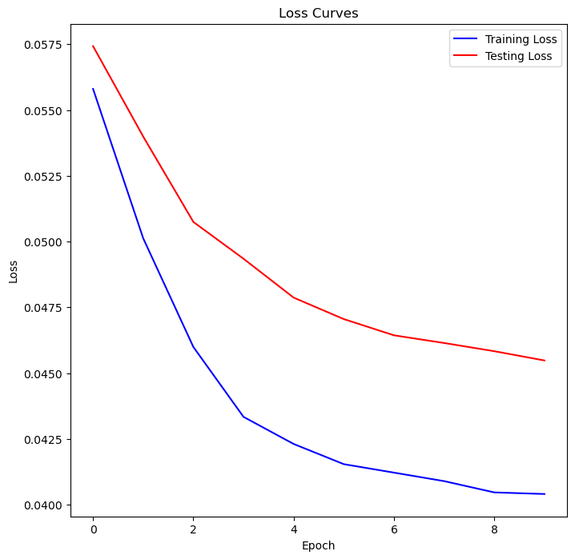
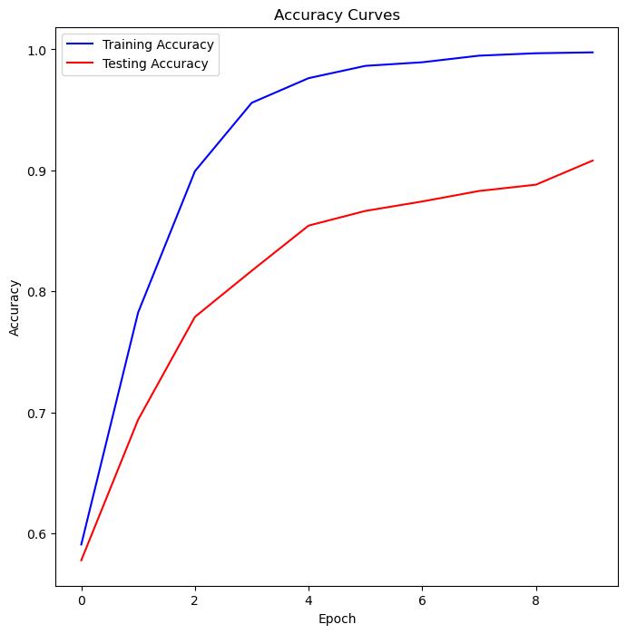
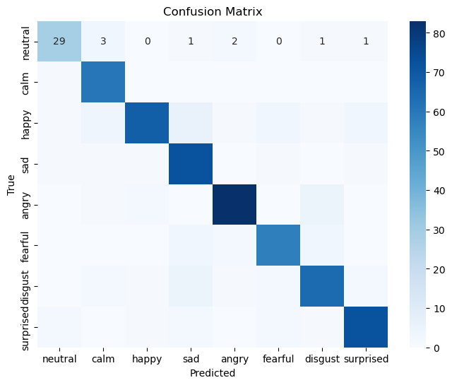

## CNN Model Overview

This document provides an overview of a Convolutional Neural Network (CNN) model that has been trained and evaluated with the following parameters and results.

### Training Parameters

- **Loss Function**: CrossEntropyLoss

  - The criterion used for training the model is `nn.CrossEntropyLoss()`. This loss function is commonly used for classification tasks and measures the performance of a classification model whose output is a probability value between 0 and 1.

- **Learning Rate**: 0.001

  - The learning rate determines the step size at each iteration while moving toward a minimum of the loss function. A learning rate of 0.001 is relatively low, which means the model updates its weights more gradually with each iteration.

- **Optimizer**: Adamax

  - The optimizer used is `optim.Adamax`, which is a variant of the Adam optimizer based on the infinity norm. It is designed to be more stable and perform better with sparse gradients. Adamax combines the advantages of both AdaGrad and RMSprop, making it suitable for a wide range of deep learning tasks. Additionally, L2 regularization is applied with a weight decay of 1e-4 to prevent overfitting.

  - **Learning Rate Scheduler**: ReduceLROnPlateau

  - The learning rate scheduler used is `torch.optim.lr_scheduler.ReduceLROnPlateau`. It reduces the learning rate by a factor of 0.5 if the monitored metric does not improve for 10 consecutive epochs. This helps in fine-tuning the learning rate dynamically based on the model's performance, preventing it from getting stuck in local minima.

- **Epochs**: 100
  - An epoch refers to one complete pass through the entire training dataset.

### Final Training Results

- **Final Epoch**: [100/100]

- **Training Loss (TRLoss)**: 1.2928

- **Training Accuracy (TRAccuracy)**: 99.75%

- **Test Loss (TSLoss)**: 0.0455

- **Test Accuracy (TSAccuracy)**: 90.81%

### Learning Rate Scheduler Adjustments

- **Epoch 82**: Reduced learning rate to 0.0005

### Loss and Accuracy Curves

### Validation Report:

              precision    recall  f1-score   support

     neutral       0.85      0.78      0.82        37
        calm       0.85      0.98      0.91        61
       happy       0.93      0.78      0.85        87
         sad       0.81      0.94      0.87        77
       angry       0.93      0.91      0.92        91
     fearful       0.88      0.88      0.88        66
     disgust       0.85      0.83      0.84        77
    surprised      0.91      0.90      0.91        80

     accuracy                          0.88       576
     macro avg     0.88      0.88      0.87       576
    weighted avg   0.88      0.88      0.88       576

